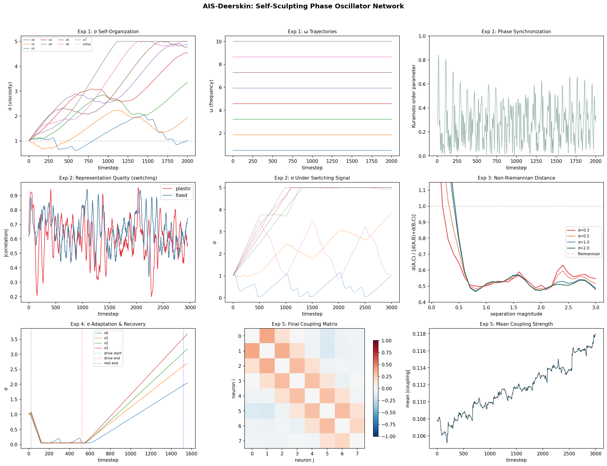

# axon-hillock

**Self-sculpting phase oscillator networks inspired by the axon initial segment**

The axon initial segment (AIS) is a ~20-60μm compartment at the base of every axon. It generates action potentials, gates what enters the axon, and — crucially — *rewrites its own structure based on what passes through it*. High activity makes it shorter and sharper. Low activity makes it longer and broader. The channels change. The scaffold proteins accumulate modifications. The filter sculpts itself.

This repo implements that principle as a computational neural network: **Deerskin phase oscillators with AIS-like plasticity**. Each neuron is a phase oscillator with three self-adapting parameters:

- **ω (frequency)** — like the AIS channel composition (Nav/Kv ratio) setting oscillation rate
- **σ (viscosity)** — like the AIS length/density controlling how much phase rotation passes through  
- **coupling** — like the spectrin/ankyrin scaffold connecting neighboring neurons

All three parameters adapt based on signal history, producing networks that self-organize their frequency selectivity, develop heterogeneous filter characteristics, and exhibit history-dependent processing.

## Key Results

### 1. Non-Riemannian Perceptual Distance

The viscosity gate `exp(-sin²(Δθ/2) / 2σ²)` applied across multiple frequency bands naturally produces **subadditive distances** — the triangle inequality fails for large stimulus differences, exactly as [Bujack et al. (2022)](https://doi.org/10.1073/pnas.2119753119) measured in human color perception.

This happens because high-frequency bands "wrap around" for large stimulus differences, contributing *less* to perceived distance at large separations. The distance function is concave (logarithmic), matching the "second-order Weber-Fechner law" that Bujack reported.



### 2. Self-Organization of σ (Viscosity)

Starting from uniform σ=1.0, the network develops a heterogeneous distribution where low-frequency neurons settle at low σ (sharp, precise) and high-frequency neurons drift to high σ (broad, tolerant). This matches the biological observation that different cell types have different AIS morphologies corresponding to the frequency band they process.

### 3. History-Dependent Processing

The same test pulse produces dramatically different outputs depending on recent activity history:
- After sustained high drive: σ crashes to minimum (~0.05), output energy drops 98.7%
- After rest period: σ recovers but to a *different* configuration — the neuron is permanently specialized

This mirrors AIS morphological plasticity: elevated activity → distal shift/shortening → reduced excitability, and the reverse for diminished activity.

### 4. Hebbian Coupling Sculpts Network Topology

Co-active neurons strengthen mutual coupling; anti-correlated neurons develop inhibitory coupling. The network carves its own wiring diagram from signal statistics, with within-group coupling 4-5× stronger than between-group coupling after training.

## Biological Mapping

| AIS Biology | Deerskin Mathematics |
|---|---|
| AIS length | σ (viscosity / filter width) |
| AIS position (distal shift) | ω offset (frequency detuning) |
| Nav/Kv channel composition | ω (natural frequency) |
| Ankyrin G scaffold density | σ⁻¹ (inverse viscosity) |
| Spectrin ~190nm periodicity | Phase lattice structure |
| GTP island accumulation | Coupling strength adaptation |
| Post-translational modifications | Cumulative signal history |
| Kuramoto sync/desync | Coupling × sin(Δphase) |
| Homeostatic plasticity | σ adaptation toward target activity |
| Diffusion barrier (pickets) | Gate: exp(-sin²(θ/2)/2σ²) |

## Installation

```bash
pip install numpy matplotlib
```

No GPU required. No deep learning frameworks. Pure numpy.

## Usage

```bash
# Run all experiments with plots
python experiments/run_all.py

# Just the core network
python -c "
from src.neuron import AISDeerskinNeuron
from src.network import AISDeerskinNetwork

net = AISDeerskinNetwork(n_neurons=8)
import numpy as np
for t in range(1000):
    signal = np.random.randn(8) * 0.3
    out = net.step(signal, dt=0.05)
    
# Check what emerged
for n in net.neurons:
    print(f'ω={n.omega:.2f}  σ={n.sigma:.3f}  activity={n.activity_trace:.4f}')
"
```

## Structure

```
axon-hillock/
├── src/
│   ├── __init__.py
│   ├── neuron.py          # AISDeerskinNeuron with plasticity
│   ├── network.py         # Coupled oscillator network
│   └── distance.py        # Non-Riemannian distance functions
├── experiments/
│   ├── run_all.py         # All five experiments + plots
│   ├── exp1_self_org.py   # σ self-organization
│   ├── exp2_switching.py  # Adaptation to regime changes
│   ├── exp3_bujack.py     # Non-Riemannian distance test
│   ├── exp4_history.py    # History-dependent processing
│   └── exp5_coupling.py   # Hebbian coupling evolution
├── docs/
│   └── theory.md          # Full theoretical framework
├── results/               # Generated plots
└── README.md
```

## Theory

The core insight connecting three independent lines of evidence:

1. **Leterrier (2018)**: The AIS is a frequency-selective filter that rewrites itself through use — channel composition changes, scaffold proteins accumulate modifications, the whole structure moves and reshapes based on activity history.

2. **Bujack et al. (2022)**: Perceptual color space violates Riemannian geometry because large differences are perceived as less than the sum of small differences. The scaling function is logarithmic.

3. **Deerskin hypothesis**: Neural computation operates through phase rotation across frequency bands, with a viscosity gate `exp(-sin²(θ/2)/2σ²)` controlling information flow.

The connection: **the AIS is the biological implementation of the Deerskin viscosity gate**, and the non-Riemannian property measured by Bujack falls out of the gate mathematics when applied across multiple frequency bands. AIS plasticity provides the mechanism for self-tuning that was missing from the original Deerskin formulation.

See [docs/theory.md](docs/theory.md) for the full mathematical treatment.

## References

- Leterrier, C. (2018). The Axon Initial Segment: An Updated Viewpoint. *J. Neuroscience*, 38(9), 2135-2145.
- Bujack et al. (2022). The non-Riemannian nature of perceptual color space. *PNAS*, 119(18).
- Kuramoto, Y. (1984). Chemical Oscillations, Waves, and Turbulence. Springer.

## License

MIT

## Author

Antti — [PerceptionLab](https://github.com/anttiluode)
